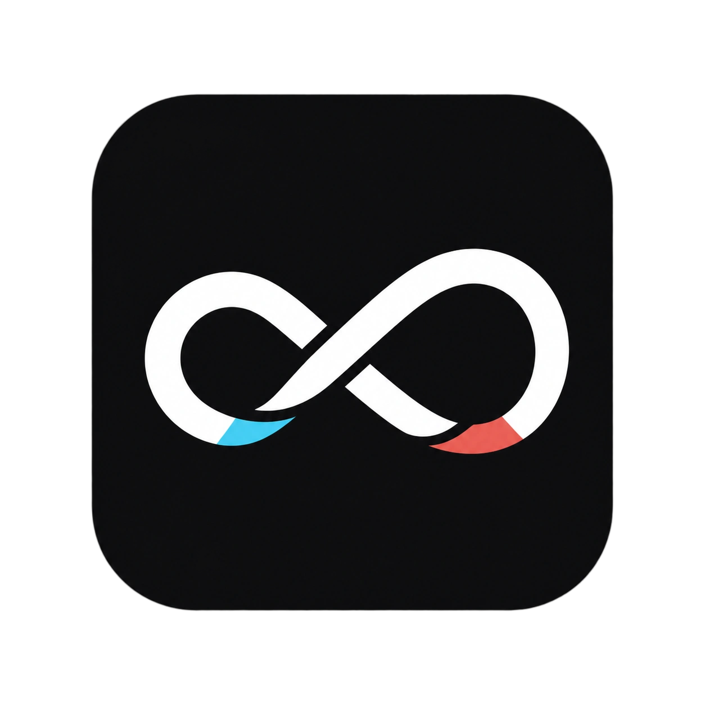

<p align="center">
  
</p>

<h1 align="center">无限次元 (canvas-agent)</h1>

<p align="center">
  <a href="https://render.com/deploy?repo=https://github.com/onelxw/canvas-agent"></a>
  <a href="https://github.com/onelxw/canvas-agent/tags"></a>
  <a href="LICENSE"></a>
  <a href="https://vite.dev/"></a>
  <a href="https://reactrouter.com/"></a>
</p>

<p align="center">
  <a href="docs/content/docs/overview/quick-start.mdx">快速开始</a> · <a href="docs/content/docs/overview/features.mdx">功能介绍</a> · <a href="docs/content/docs/overview/render.mdx">Render 部署</a> · <a href="docs/content/docs/overview/docker.mdx">Docker 部署</a> · <a href="docs/content/docs/canvas/canvas-node-manual.mdx">画布节点操作手册</a> · <a href="docs/content/docs/canvas/canvas-shortcuts.mdx">画布快捷键</a> · <a href="SECURITY.md">漏洞提交</a> · <a href="docs/content/docs/progress/todo.mdx">待办事项</a> · <a href="canvas-agent/README.md">本地 Canvas Agent</a> · <a href="plugins/infinite-canvas">Codex app 插件</a>
</p>

无限次元是一款面向图片创作的开源工作台。它把画布编排、AI 图片生成、参考图编辑、对话助手、提示词库和素材沉淀放在同一个界面里，适合用来探索视觉方案并连续迭代图片结果。

## 分叉基线与维护定位

本仓库是 [`basketikun/infinite-canvas`](https://github.com/basketikun/infinite-canvas) 的定制分支，长期开发只推送到 [`onelxw/canvas-agent`](https://github.com/onelxw/canvas-agent)。

| 项目 | 版本/提交 |
| --- | --- |
| 上游分叉点 | [`ed013e8`](https://github.com/basketikun/infinite-canvas/commit/ed013e8e5ce8ccab47cf2fc779f8e94555eb4c23)（2026-08-27） |
| 最近的前置发布版 | `v0.16.0`；分叉点位于该标签之后 23 个提交，即 `v0.16.0-23-ged013e8` |
| 首个包含该分叉点的上游发布版 | `v0.17.0`（分叉点之后还有 2 个上游提交） |
| 最近一次核对的上游版本 | `v0.18.0` / `d213a74`（2026-09-07，尚未合并，核对日期 2026-09-11） |
| 本分支 | `origin/main`；以 `ed013e8..main` 作为分叉差异的权威范围 |

> [!IMPORTANT]
> 后续同步上游时，不要仅按 `v0.16.0` 或 `v0.17.0` 推断基线，应使用完整分叉点 `ed013e8e5ce8ccab47cf2fc779f8e94555eb4c23`。仓库约定 `upstream` 只读，所有开发提交仅推送到 `origin`。

## 相对上游的定制变更

以下仅记录 `ed013e8..main` 范围内的分叉变更。完整逐项记录见 [CHANGELOG.md](CHANGELOG.md)，内置 Agent 的架构说明见 [应用内置画布 Agent](docs/content/docs/development/internal-canvas-agent.zh-CN.mdx)。

### 新增功能

- **应用内置画布 Agent**：右侧 Agent 可直接使用渠道中配置的文本模型，不再要求用户安装 Codex、MCP 或本地 Canvas Agent；支持 OpenAI Responses API 与 Chat Completions API 的流式工具调用。
- **受控工具循环**：提供固定工具白名单、Zod 严格校验、项目与 revision 防冲突、独立的读取/画布修改/付费生成权限、逐次确认、中断、轮次及工具数量限制。
- **Agent 持久化对话**：多条对话历史、切换、删除及旧单会话迁移均保存在 IndexedDB；运行中的任务在刷新后会标记为中断。
- **Agent 安全边界**：配置导出默认排除 API Key 与 WebDAV 密码，工具结果脱敏并限制长度，内置 Agent 不能访问任意网络、脚本或配置工具。
- **Agent 自动化测试**：覆盖协议解析、工具白名单、参数校验、重复调用保护、权限确认、revision、操作上限和上下文裁剪。
- **工作台自绘滚动区**：生图和视频工作台使用 3px 无箭头滑块，滚动或拖动时显示，闲置后隐藏。

### 修改与修复

- **兼容中转接口**：工具参数使用 JSON Schema Draft 7，避免布尔型 `exclusiveMinimum`、provider strict Schema、空工具参数及强制用量流选项造成“已计费但 upstream failure”。
- **生成流程复用节点**：`canvas_create_generation_flow` 可通过 `promptNodeId` 直接复用已有文本节点，避免为“已有文本 → 生成配置”流程创建重复提示词节点；网页内置 Agent 与本地 Agent 行为一致。
- **revision 冲突控制**：选区和视口变化不再增加 revision；同一批 Agent 连续写入可安全衔接自身产生的 revision，真实外部内容变化仍会拒绝旧版本写入。
- **单渠道配置**：渠道收敛为一个内置渠道，接口固定为 `https://api.aiacg.de`，协议、API Key 与模型在渠道页直接编辑；默认聊天模型为 `gpt-5.6-terra`。
- **工作台参数**：生图参数改为“质量、比例、生成张数”下拉框；视频参数改为“清晰度、比例、秒数”下拉框，比例选项显示对应分辨率。
- **画布交互**：空白画布由双击左键创建节点改为单击右键创建，节点和连线原有右键菜单不变。
- **Agent 界面**：“思考中”仅在等待模型回应时显示；工具过程默认折叠，状态、摘要和折叠箭头保持单行。
- **品牌与导航**：产品名改为“无限次元”，顶部及 favicon 使用随深浅主题切换的图标；移除页面顶部文档、GitHub、版本号、更新日志与检查更新入口，画布菜单不再显示文档入口。
- **官方插件来源**：官方插件注册表改为 `onelxw/canvas-agent@plugins-dist`，保留 Markdown、SVG、HTML、3D 全景和便利贴插件。
- **Docker 部署**：Compose 默认从当前源码构建，默认宿主机端口为 `3020`，增加健康检查；Linux 镜像构建时统一启动脚本换行格式，避免容器重启循环；镜像与工作流指向当前分支仓库。

### 删除或收敛的功能

- 删除新增渠道、删除渠道和二级“编辑渠道”流程，同时取消自定义渠道接口地址；这是当前产品的固定单渠道策略。
- 删除生图工作台的独立尺寸输入，以及视频工作台的自定义清晰度和自定义尺寸输入，改由预设下拉项统一控制。
- 删除标准页面及画布内的文档、GitHub、版本号、更新日志和检查更新入口。
- 删除双击空白画布创建节点的入口，统一改为右键菜单。
- 默认画布 Agent 不再依赖 Codex、MCP 和本地 Canvas Agent；相关本地 Agent 源码与兼容能力仍保留在仓库中，并未物理删除。
- README 删除了上游赞助商广告、联系方式、社区支持、Star History 和赞助支持等推广内容。

## 上游更新合并指南

### 建议优先评估的通用改动

| 优先级 | 改动 | 合并建议 |
| --- | --- | --- |
| 高 | API 工具 Schema 兼容修复 | 通用兼容性修复，优先检查上游是否已有等价实现；没有时适合移植。 |
| 高 | `promptNodeId` 复用已有文本节点 | 行为独立、测试完备，可在上游仍会创建重复节点时移植。 |
| 高 | revision 批量衔接与选区/视口降噪 | 可减少 Agent 自冲突，但合并前应核对上游是否重构了画布状态版本机制。 |
| 高 | Docker CRLF 归一化与健康检查 | 通用部署修复；仓库名、镜像名和外部端口属于本分支配置，不应照搬。 |
| 中 | 应用内置画布 Agent、历史记录与安全边界 | 体系化新增，涉及文件较多；适合按架构整体评估，不建议零散摘取。 |
| 中 | 工作台滚动区、参数下拉框、右键创建节点 | 属于可独立移植的交互改进，但需要先确认上游最新 UI 是否已经变化。 |

### 通常不应从上游覆盖的本分支定制

- “无限次元”品牌名称、主题图标及导航精简。
- 固定 `api.aiacg.de` 的单渠道策略和 `gpt-5.6-terra` 默认模型。
- `onelxw/canvas-agent` 的仓库、GHCR、插件注册表地址及 Docker 外部端口 `3020`。
- 已删除的推广、版本检查及外部跳转入口，除非产品需求明确恢复。

### AI 同步检查步骤

```bash
git fetch upstream --tags

# 本分支从分叉点以来的全部定制
git log --oneline ed013e8e5ce8ccab47cf2fc779f8e94555eb4c23..main
git diff --stat ed013e8e5ce8ccab47cf2fc779f8e94555eb4c23..main

# 上游从共同祖先以来的新变化
git log --oneline main..upstream/main
git diff --stat main...upstream/main
```

同步时应先创建临时分支，逐项对照本节和 [CHANGELOG.md](CHANGELOG.md)，将变更标记为“上游已有等价实现 / 适合移植 / 本分支定制需保留 / 存在冲突需人工决定”。不要直接向 `upstream` 推送，也不要在未核对渠道、品牌、插件注册表和 Docker 配置的情况下整分支覆盖。

> [!CAUTION]
> 项目目前处于开发阶段，不保证历史数据兼容。各种本地存储格式都可能直接调整，欢迎关注后续更新。
>
> 如果你需要稳定维护自己的分支，建议自行 fork 后独立开发。二次开发与 PR 请保留原作者信息和前端页面标识。

## 核心功能

- 无限画布：多画布项目、节点拖拽缩放、连线、小地图、撤销重做、导入导出。
- AI 创作：浏览器前台直连内置渠道地址，使用用户配置的协议、API Key 和模型，支持文生图、图生图、参考图编辑、文本问答、音频和视频生成。
- 内置画布 Agent：直接使用渠道中的文本模型，通过受控工具读取和修改画布，无需安装 Codex、MCP 或本地服务。
- 可选本地 Agent：仓库仍保留 Canvas Agent 与 Codex App 插件，供兼容旧流程和开发调试使用。
- 插件系统：支持通过 URL 动态安装 / 启用 / 更新 / 卸载远程节点插件，并提供 TypeScript SDK 自行开发画布节点插件。
- 自定义接口调用：可自定义生图 / 视频接口的调用方式，灵活适配各类中转站与自建服务。
- 提示词库：内置 7 个开源提示词来源并支持自定义标准 JSON 来源，由浏览器前端直连并缓存到 IndexedDB。

完整功能说明见 [功能介绍](docs/content/docs/overview/features.mdx)。

## 快速开始

AI API Key、模型配置、画布、素材和生成记录默认保存在浏览器本地。

### 本地开发

```bash
git clone https://github.com/onelxw/canvas-agent.git
cd canvas-agent
cd web
bun install
bun run dev
```

### Docker 运行

```bash
git clone https://github.com/onelxw/canvas-agent.git
cd canvas-agent
docker compose up -d --build
```

运行后默认端口为 3020，可访问 `http://localhost:3020`。

首次打开后进入配置页，在固定渠道中填写协议、`API Key` 和模型。

如果默认的OpenAI接口调用方式与您的API不同，可自定义生图/视频脚本调用。

## 效果展示

<table width="100%">
  <tr>
    <td width="50%"></td>
    <td width="50%"></td>
  </tr>
  <tr>
    <td width="50%"></td>
    <td width="50%"></td>
  </tr>
  <tr>
    <td width="50%"></td>
    <td width="50%"></td>
  </tr>
  <tr>
    <td width="50%"></td>
    <td width="50%"></td>
  </tr>
</table>

## 开源协议

本项目使用 [MIT License](LICENSE)。任何人都可以免费使用、复制、修改、分发、再授权和商业使用本项目，也可以用于闭源产品。
